# ExamSage（押题宝）

**A local, privacy-conscious study Agent that turns approved university course material into a cited, progressively built study map.**

Current release: **0.6.0** — multimodal evidence-engine alpha.

> ExamSage predicts revision priorities, not future exam questions. Its rankings and generated answers are uncertain study aids and require human verification.

## What 0.6.0 delivers

- A runtime-switchable English or Simplified-Chinese interface. Generated academic content follows the language of the current user message unless that message explicitly requests another output language.
- A native folder picker, with a browser-directory snapshot fallback, followed by an exact visible manifest and explicit approval.
- OpenAI or Google Gemini using **one provider API key**; no second credential is needed for multimodal analysis.
- Local preparation of text, structured data, modern Office files, images, PDFs, and safe ZIP members, followed by bounded provider analysis of approved parts only.
- A cited **Initial study map** as soon as representative evidence is ready, while remaining sources stay visibly pending, processing, retrying, or failed.
- A cited **Complete study map** only after every approved source part reaches a terminal processed or visible-failure state.
- Exact source/part/byte coverage, durable activity events, cooperative Stop, explicit Resume, bounded retries, and reuse of durably published validated source-part results after restart.
- Content-addressed evidence caching and dependency-aware invalidation when an approved source changes.

This is Subproject 3 of the wider product roadmap. Request-specific web research, adaptive practice generation, worked solutions and rubrics, the final three-pane UI, packaging, and removal of the fixed legacy pipeline remain later work. Existing legacy reports remain readable.

## Agent launch with one provider API key

Install Python 3.11 or 3.12, download this repository, then run the Agent route:

### Windows PowerShell

```powershell
$env:EXAMSAGE_AGENT_V2 = "1"
.\launch_windows.bat
```

### macOS Terminal

```bash
EXAMSAGE_AGENT_V2=1 ./launch_macos.command
```

The launcher creates `.venv`, installs the pinned application dependencies, starts an authenticated Worker bound to `127.0.0.1`, and opens the local Streamlit interface. Choose OpenAI or Google Gemini and connect one key. The Agent Worker stores the key through Windows Credential Manager or macOS Keychain; if the OS vault is unavailable, connection fails without a plaintext fallback.

The standard launch scripts without `EXAMSAGE_AGENT_V2=1` still open the compatibility route during this staged migration. That route is not the recommended evidence-engine evaluation path.

## Evidence flow

```mermaid
flowchart LR
    A["Select course folder"] --> B["Local safe scan"]
    B --> C["Review and exclude sources"]
    C --> D["Approve exact revision and hashes"]
    D --> E["Revalidate one approved read"]
    E --> F["Prepare bounded source parts"]
    F --> G["Selected provider analyzes approved bytes"]
    G --> H["Validated local evidence cache"]
    H --> I["Initial cited study map"]
    I --> J["Complete coverage or visible failures"]
    J --> K["Complete cited study map"]
```



Before approval, course bytes are ineligible for provider transmission. Approval binds the current manifest revision, included entry IDs, and SHA-256 hashes. Immediately before each use, ExamSage rechecks root containment, file identity, metadata, and hash, then grants a short-lived, single-use read. Only the exact prepared part needed by the active evidence operation is sent.

The local evidence cache is keyed by source hash, prepared-part identity, provider route, schema, prompt, and policy versions. Unchanged approved content can be reused. A changed or substituted source requires rescan and reapproval, invalidates only evidence and study-map dependencies derived from that source, and never silently reuses its old result.

## Progressive coverage, timeouts, and retries

The Initial study map contains citations only to evidence that has already completed. Its coverage banner reports what is included and what remains pending or failed; it is not presented as complete. The Complete study map uses all successfully processed approved evidence and still exposes any terminal source failure.

Default evidence limits are deliberately bounded:

- multimodal concurrency: 2, configurable only within 1–4;
- provider request timeout: 90 seconds;
- whole evidence-tool deadline: 60 minutes;
- first-map target: 180 seconds, not a guarantee;
- at most 3 attempts per provider route and at most 1 structured-output repair;
- provider `Retry-After` is respected within the remaining deadline;
- PDF preparation uses 24-page parts by default and prepared parts are capped at 10 MiB by default.

Stop is cooperative at durable graph boundaries. Closing the launcher asks the Worker to pause, but an abrupt exit may resume from the most recent completed checkpoint rather than the exact instant the window closed. Resume is always explicit.

Durably published validated source-part results are reused and are not sent again on Resume. An abrupt crash after a provider returns but before the result is atomically published can repeat that unpublished attempt; an unpublished planner or synthesis call can likewise be repeated. ExamSage therefore provides bounded, checkpointed at-least-once execution around that crash window, not an external exactly-once guarantee.

## Supported course sources

| Category | Formats | Preparation behavior |
|---|---|---|
| Documents | PDF, DOCX, PPTX | PDFs are split into bounded page groups; OOXML text and embedded media are extracted locally. |
| Legacy Office | DOC, PPT, XLS | Requires an explicitly available LibreOffice converter behind the secure sandbox interface; otherwise the source fails visibly as converter unavailable. |
| Data | XLSX, CSV, TSV, JSON, YAML | Bounded local parsing; modern Office parts and images remain separately traceable. |
| Text/web files | MD, TXT, HTML | Local files only. Arbitrary URLs are not fetched by the workspace scanner. |
| Images | PNG, JPEG, WebP, GIF, BMP, TIFF | Sent as bounded multimodal parts to the chosen provider after approval. |
| Bundles | ZIP | Members are checked for containment, links, count, expanded size, and compression ratio before use. |

The selected workspace is capped at 1 GiB. Symlinks, junctions, reparse points, executable/unsupported formats, unsafe archive members, and unprovable substitutions fail closed. Audio and video are not supported in this release.

## Provider privacy and retention

ExamSage has no maintainer-operated backend or telemetry. The selected provider nevertheless receives the approved parts required by the active task, and that provider's retention, safety-monitoring, regional-processing, account, and billing rules apply. Agent-mode OpenAI requests explicitly use `store: false`; legacy or custom-endpoint behavior can differ. Gemini temporary uploads are deleted best-effort after analysis, but provider-side operational retention may still apply.

Do not process material unless you are authorized to share it with the chosen provider. Read [PRIVACY.md](PRIVACY.md) and [SECURITY.md](SECURITY.md) before using confidential, regulated, copyrighted, embargoed, or third-party personal data.

## Local storage and deletion

Application state defaults to `~/.examsage`; set `EXAMSAGE_DATA_DIR` to choose another local location.

- A native workspace never copies, edits, or deletes the selected source folder. Deleting it removes only ExamSage-owned manifests, approvals, evidence, prepared artifacts, runs, events, and checkpoints.
- The browser fallback creates an ExamSage-owned snapshot. Deletion is limited to its recorded, identity-verified tree below the application data root.
- Unverifiable or partial cleanup remains visible as `cleanup pending`; ExamSage does not widen the target.
- Old compatibility-route upload copies are only counted and removed through the explicit cleanup control. Active, substituted, linked, unknown, or otherwise unverified entries are not removed.
- `Forget API key` deletes the provider credential from the OS vault but does not delete course workspaces.

## Opt-in live benchmark

Automated tests use synthetic course material, fake providers, injected clocks, and fake vaults. They prove deterministic behavior but are not live-provider or native-platform evidence.

The **Opt-in live benchmark** must be launched from an already running Agent Worker, uses an explicitly connected provider profile and the declared CC0 synthetic fixture, refuses to run in CI, and never accepts a real/private course folder. It records safe machine/provider/model metadata, source and page counts, durable logical provider-operation receipts, retries visible to ExamSage, first activity, initial/final timing, exact coverage, and safe error codes. Provider SDK-internal transport retries and a billing estimate are not observable.

```powershell
.\.venv\Scripts\python.exe scripts\benchmark_initial_map.py `
  --live `
  --provider-profile <saved-profile-id> `
  --fixture <generated-cc0-reference-course> `
  --output <new-report.json>
```

Output is created exclusively and will not overwrite an existing report. The benchmark excludes ZIP duplicates from the approved benchmark corpus. It does not print keys, absolute source paths, signed URLs, or source contents. Current live and platform results are listed in [the 0.6.0 manual checkpoints](docs/manual-tests/2026-07-27-multimodal-evidence-checkpoints.md).

## Known limitations

- No real OpenAI or Gemini benchmark, OS keyring, native picker, browser fallback, or clean-launch result is claimed until the corresponding manual checkpoint is completed.
- Initial-map timing depends on provider availability, source complexity, network conditions, and explicit model choices; 180 seconds is a target, not a service guarantee.
- Handwriting, equations, diagrams, OCR, and model-produced evidence can be wrong.
- Legacy DOC/PPT/XLS conversion is unavailable unless a secure sandbox runner is supplied; installing LibreOffice alone is insufficient.
- OpenAI-compatible custom endpoints remain experimental and do not guarantee the full multimodal, citation, search, or privacy contract.
- Windows and macOS launchers are not code-signed.
- This release builds evidence-backed course maps. Later product stages add research, practice, rubrics, export, final UX, installers, and academic-quality evaluation.

## Legacy developer fallback

The fixed legacy route remains only as a temporary compatibility and developer fallback. It uses the older all-or-nothing build path, has different key/storage behavior, and is not evidence-engine acceptance evidence. Start it by leaving `EXAMSAGE_AGENT_V2` unset or setting it to `0`. Existing saved reports remain readable, and abandoned upload copies are never imported as approved Agent evidence.

## Development and verification

```powershell
.\.venv\Scripts\python.exe -m pytest -q
.\.venv\Scripts\python.exe -m ruff check .
.\.venv\Scripts\python.exe -m compileall -q app.py exam_predictor scripts tests
.\.venv\Scripts\python.exe scripts\check_secret_patterns.py --root .
.\.venv\Scripts\python.exe -m pip check
```

Tests run without API keys. See [CONTRIBUTING.md](CONTRIBUTING.md) for contribution and live-test rules.

## License

[MIT](LICENSE). Uploaded materials, generated reports, and third-party sources retain their respective rights.
