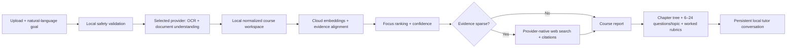

# ExamSage

**A local, privacy-conscious agent that turns university course materials into a chapter map, evidence-aware exam focus ranking, adaptive practice bank, worked solutions, and an ongoing tutor.**

ExamSage is designed for undergraduate courses across mathematics, physics, chemistry, biology, engineering, humanities, business, law, languages, and interdisciplinary subjects. It supports multilingual course material and global academic sources.

> ExamSage predicts **revision priorities**, not actual exam questions. A ranking is uncertain evidence—not a promise that a topic will appear.

## What makes it useful

- Drop in PDFs, slides, Word documents, spreadsheets, scans, handwriting, images, Markdown, HTML, JSON, webpages, or a ZIP.
- Describe the exam and your goal in normal language.
- Review a cost estimate and approve a hard spending limit before any AI task starts.
- Receive a hierarchical chapter tree, knowledge summaries, prerequisites, focus scores, confidence labels, and supporting evidence.
- Get **6–24 questions per knowledge point**, adjusted by importance and similar past-question density.
- Every generated question includes a worked answer, suggested total marks, and marks for each step or knowledge point.
- When the uploaded evidence is sparse, ExamSage uses the selected provider's native web search and shows citations.
- Continue asking questions in the same course conversation until the explanation is satisfactory.
- Export the result as PDF, Markdown, or structured JSON.

## Start in three steps

### Windows

1. Install [Python 3.11 or 3.12](https://www.python.org/downloads/).
2. Download or clone this repository.
3. Double-click `launch_windows.bat`.

### macOS

1. Install [Python 3.11 or 3.12](https://www.python.org/downloads/).
2. Download or clone this repository.
3. Control-click `launch_macos.command`, choose **Open**, and accept the first-run warning.

The launcher creates an isolated environment, installs dependencies, and opens `localhost` in the browser. In the page, choose OpenAI or Google Gemini and enter **one API key**. The legacy build flow keeps the key in the browser session. In the optional Agent route, the authenticated local Worker saves it through the operating-system credential vault when that vault is available; it never writes a plaintext fallback.

Manual launch:

```bash
python -m venv .venv
# Windows: .venv\Scripts\activate
# macOS: source .venv/bin/activate
python -m pip install -r requirements.txt
streamlit run app.py
```

## Provider choice

| Choice | One key | Files & images | Embeddings | Native web search | Status |
|---|:---:|:---:|:---:|:---:|---|
| OpenAI | Yes | Yes | Yes | Yes | First-class |
| Google Gemini | Yes | Yes | Yes | Yes | First-class |
| OpenAI-compatible URL | Yes | Provider-dependent | Usually | Provider-dependent | Experimental |

ExamSage automatically routes bulk extraction to a cost-sensitive model, ordinary synthesis to a balanced model, and difficult reasoning/review to a stronger model—all under the selected provider and key. Advanced users can override model IDs in the UI.

This is how someone can avoid OpenAI pricing without making setup complicated: select **Google Gemini**, paste a Gemini key, and keep the rest of the workflow unchanged. Additional first-class providers should only be added when they can cover chat, multimodal files, embeddings, grounded search, citations, and privacy controls with one credential.

## What “OCR” means

OCR stands for **Optical Character Recognition**. A normal PDF often already contains selectable text; a scan or phone photo contains only pixels. OCR turns those pixels—printed words, labels, and sometimes handwriting—into text the agent can search and reason over.

ExamSage does not install a local OCR or AI model. It sends the image or scanned page directly from the user's device to the chosen multimodal provider. The provider reads the text and also explains diagrams, formulas, tables, and charts. For `.docx`, `.pptx`, and `.xlsx`, ExamSage additionally extracts embedded images and submits them because some provider document parsers otherwise see only the text layer.

## The agent workflow



In agent terminology:

- The **model** is the reasoning engine supplied by OpenAI or Gemini.
- **Tools** are actions the model can use, such as file vision, embeddings, or web search.
- **Memory** is the local course report and chat history.
- The **orchestrator** is the Python code that decides which tool runs next, enforces the budget, and labels evidence.
- **Grounding** means tying claims to uploaded material or cited public sources instead of relying only on model memory.

ExamSage is an agent because it follows a conditional multi-step workflow, uses tools, maintains course state, and can continue acting in response to student questions. It is not just a single prompt.

## Agent kernel and secure course workspace alpha

The LangGraph Agent route remains disabled by default. Developers can enable it with
`EXAMSAGE_AGENT_V2=1`; the standard launchers then start Streamlit and an authenticated local Worker
bound only to `127.0.0.1`. The legacy build flow remains the default, and its cost estimate and build
controls apply only to that legacy route.

The Agent workspace uses a native folder picker first. A development fallback can upload a browser
directory snapshot when native selection is unavailable. Scanning is deterministic and local. The UI
shows every discovered item as `pending approval`, `approved`, `excluded`, `failed`, `changed`, or
`removed`, together with a safe reason when action is required. The aggregate workspace limit is
1 GiB (1,073,741,824 bytes).

Before approval, no course source is eligible to cross the provider boundary. Approval binds the exact
manifest revision and SHA-256 hashes of the included files. Excluding a supported file keeps it local.
A rescan preserves unchanged approved entries, while new, changed, moved, removed, substituted, or
link-like sources require review. The transmission gate revalidates path containment, file identity,
metadata, and content immediately before issuing a short-lived, single-use read token.

Approved files are sent to the configured provider only when a later user task invokes a provider tool
that needs them. The secure-workspace subproject itself performs no cloud source analysis, OCR,
embedding, grounded research, or report generation.

In the Agent route, one provider key is stored through Windows Credential Manager or macOS Keychain via
the operating-system vault abstraction. If secure storage is unavailable, ExamSage does not create a
plaintext credential file; reconnect after the vault is restored. `Forget API key` disconnects that
provider profile and deletes its vault credential while leaving course workspaces intact.

Deleting a native workspace removes ExamSage's manifest, approval, run, event, and checkpoint metadata;
it never deletes or edits the selected native folder. Deleting a browser snapshot may remove only the
identity-verified snapshot below ExamSage's own data directory. Incomplete owned cleanup remains visibly
`cleanup pending` for retry rather than widening the deletion target.

The kernel also provides durable ordered activity events, a globally serialized message queue,
cooperative Stop at safe graph boundaries, SQLite checkpoints, and explicit Resume. Startup restores
saved provider sessions from the OS vault and recovers unfinished `running` or `stopping` metadata as
`paused`; work never resumes implicitly. Launcher shutdown requests a safe pause, but Resume still
continues from the latest durable graph boundary.

## Scoring and question allocation

The relative focus score combines:

- similarity to uploaded past questions;
- explicit instructor emphasis;
- tutorial/problem-set overlap;
- syllabus verbs and weighting;
- structural signals such as definitions, theorems, proofs, applications, and comparisons;
- a provider-model pedagogical prior, weighted more heavily when past exams are scarce.

Confidence is reported separately. External university sources can clarify a topic and seed original practice variants, but **never count as proof of what the user's instructor will test**.

Practice allocation is deterministic after scoring:

- every detected knowledge point receives at least 6 questions;
- high-priority topics receive more;
- topics with more similar past questions receive more;
- the cap is 24 per knowledge point;
- external variants are visibly labelled and preserve source links.

## Privacy and safety model

ExamSage has no developer-operated backend. The browser UI runs on the user's own computer.

- Raw files travel directly to the selected provider over its official SDK.
- No local AI model is downloaded or executed.
- Deterministic local operations—validation, safe ZIP extraction, chunking, SQLite storage, and export—do not infer content.
- Legacy-flow API keys stay in Streamlit session memory. Agent credentials use the OS vault only and are never written to SQLite, checkpoints, reports, manifests, logs, exceptions, HTTP responses, or backups.
- OpenAI requests use `store: false` where the Responses API supports it.
- Gemini uploads are deleted on a best-effort basis immediately after analysis.
- ZIP traversal, symlinks, extreme compression ratios, unsupported executable content, private-network URLs, and common prompt-injection phrases are blocked or flagged.
- There is no telemetry. Streamlit usage reporting is disabled.
- Courses and conversations live under `~/.examsage` unless `EXAMSAGE_DATA_DIR` is set.
- The UI can delete a local course. `backup_windows.bat` and `backup_macos.command` create a local ZIP that excludes transient intake files and keys.

The provider still receives uploaded content and applies its own retention, abuse-monitoring, regional, and account policies. Users must review those policies before sending confidential, regulated, copyrighted, or third-party personal data. See [PRIVACY.md](PRIVACY.md) and [SECURITY.md](SECURITY.md).

## Supported inputs

| Category | Formats |
|---|---|
| Documents | PDF, DOC/DOCX, PPT/PPTX |
| Data | XLS/XLSX, CSV, TSV, JSON, YAML |
| Text/web | MD, TXT, HTML, HTTPS webpages via grounded research |
| Images | PNG, JPEG, WebP, GIF, BMP, TIFF; printed scans and handwriting |
| Bundles | ZIP with safe extraction |

The secure workspace can catalog and hash the formats above, subject to the 1 GiB aggregate limit. This
release does not yet connect workspace sources to cloud OCR, parsing, embeddings, grounded research, or
report generation; those provider tools arrive in later subprojects. Audio, video, executables, and
other unsupported extensions remain excluded. Legacy builds retain their existing direct-upload
analysis behavior and provider-specific request limits.

## Workspace troubleshooting

- **Folder moved, renamed, or replaced:** the stored canonical path or root identity no longer matches.
  Choose the folder again to create a new workspace. ExamSage will not silently follow a replacement.
- **Vault unavailable:** no plaintext fallback is created. Restore Windows Credential Manager or macOS
  Keychain access, then reconnect the provider.
- **Cleanup pending:** ExamSage could not prove or remove an owned browser snapshot safely. Keep the data
  directory available and retry deletion; do not manually repoint the workspace record.
- **Approval stale or source changed:** rescan, review every changed/new/removed item, adjust inclusion,
  and approve the current revision again. Old revision IDs and hashes are never reused automatically.
- **Native picker unavailable:** use the browser directory fallback in the Agent workspace panel. It
  creates an ExamSage-owned snapshot; deleting that workspace does not affect the original directory.

## Cost controls

Before a build, ExamSage shows a broad USD range broken down into:

1. file/image understanding;
2. knowledge analysis and report construction;
3. questions, worked answers, and rubrics;
4. optional grounded web searches.

The estimate is not an invoice. Visual page density, model output length, retries, regional taxes, provider free tiers, and price changes can affect the actual charge. A run stops before its conservative in-memory ledger would cross the approved ceiling. The provider console remains the source of truth.

## Development

```bash
python -m pip install -r requirements-dev.txt
python -m pytest
python -m ruff check exam_predictor tests scripts app.py
python -m compileall -q exam_predictor scripts app.py
```

The automated Agent-kernel and secure-workspace acceptance tests use fake providers and an in-memory
fake vault at the external boundaries. They do not use a real API key, contact a provider, open a native
picker or browser, access a real keyring, or launch application child processes. Live platform evidence
is tracked separately under `docs/manual-tests/`.

Key modules:

```text
exam_predictor/
├── agent.py            # end-to-end decisions, web fallback, tree, tutor
├── providers.py        # OpenAI/Gemini/custom adapters and budget ledger
├── cloud_analyzer.py   # multimodal OCR/document normalization
├── security.py         # upload, ZIP, URL and injection boundaries
├── pipeline.py         # alignment, scoring, generation and report
├── state.py            # local course/chat persistence; no keys
└── exporter.py         # PDF export
```

Contributions are welcome. Good first additions include provider contract tests, richer humanities question types, accessibility work, evaluation datasets with clear licenses, and installer signing. Read [CONTRIBUTING.md](CONTRIBUTING.md).

## Current status

ExamSage is an alpha-quality open-source project. It needs broader real-course evaluation before anyone should rely on its ranking quality. Known limitations:

- “exam likelihood” is relative and cannot be calibrated as a literal probability without a suitable evaluation dataset;
- provider file and search behavior can change;
- handwriting accuracy varies with image quality;
- custom compatible endpoints cannot yet guarantee the full multimodal/search/privacy contract;
- Windows and macOS launchers are not code-signed.

If this direction is useful, a GitHub star helps more students and contributors discover the project.

## License

[MIT](LICENSE). Uploaded materials, generated reports, and third-party web sources retain their respective rights. Do not republish complete copyrighted exam papers without permission.
