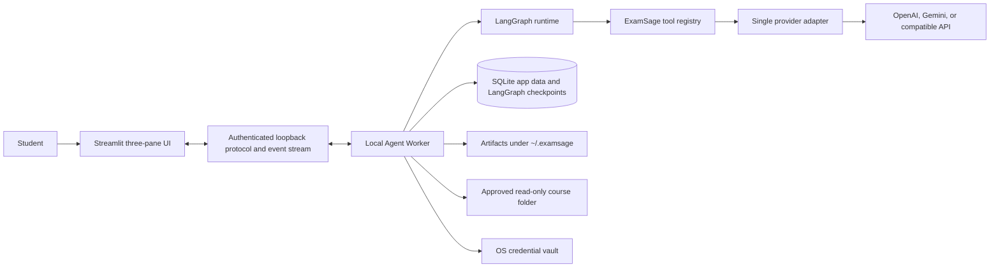
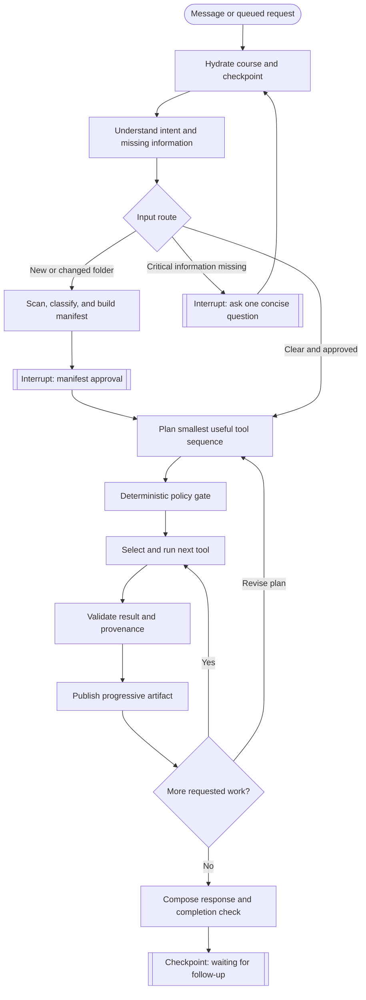

# ExamSage LangGraph Agent Design

- Status: Approved interactive design; pending written-spec review
- Date: 2026-07-17
- Product name: ExamSage
- Target repository: `ExamSage`
- Target platforms: Windows and macOS
- User interface language: English

## 1. Executive summary

ExamSage will become a chat-first, local desktop-style study Agent for undergraduate courses. A user configures one AI provider credential, opens a GPT-like conversation, selects a course folder, reviews an exact source manifest, and describes the revision outcome they want. The Agent then plans and performs only the necessary actions: understand course files, construct a chapter tree, rank evidence-backed revision priorities, research gaps on the web, generate practice, produce step-by-step solutions and marking rubrics, export study assets, or continue tutoring through follow-up conversation.

The selected architecture uses LangGraph as the local orchestration runtime. The Streamlit interface and an Agent Worker run as separate local processes started by one launcher. The Worker owns the task queue, LangGraph runs, provider calls, tool execution and checkpoints. All application state and artifacts stay under `~/.examsage`; the only required external service is the user's selected AI provider. The API key is stored in the operating-system credential vault, never in SQLite, configuration files, logs, artifacts or Git.

The current fixed `ExamSageAgent.build_course()` pipeline remains hidden as a development fallback during migration. LangGraph becomes the default route after staged acceptance tests. The fixed pipeline is deleted after feature parity and clean-install verification; it is not maintained as a permanent second product.

This design is intentionally decomposed into six implementation subprojects. They form one repository and one final application, but each has its own specification, implementation plan, tests and acceptance gate.

## 2. Product definition

### 2.1 User problem

Students often have fragmented lectures, slides, scans, problem sets, spreadsheets, notes and past papers but lack a coherent picture of:

- the course's knowledge hierarchy;
- prerequisite relationships between topics;
- which concepts and question forms have the strongest exam evidence;
- where the source material is incomplete or ambiguous;
- how much practice each knowledge point needs;
- how marks are awarded in a complete answer.

ExamSage turns these sources into an evidence-aware revision workspace and remains available as an ongoing tutor.

### 2.2 Intended users

- Undergraduate students worldwide.
- Mathematics, physics, chemistry, biology, engineering, computing, humanities, business, law, language and interdisciplinary courses.
- Users with English UI expectations, including users whose source material is multilingual.
- Users who want a downloadable open-source application and will supply and pay for their own provider API usage.

### 2.3 Product promise

ExamSage predicts revision priorities, not actual examination questions. It must never claim certainty about unseen future exams. Every priority has:

- a likelihood band rather than a fabricated literal probability;
- a separate confidence band;
- the evidence types and counts that affected it;
- visible distinction between the student's course evidence and external material.

### 2.4 What makes this a true Agent

The finished product is an Agent because it:

1. receives an open-ended goal through conversation;
2. maintains durable course and conversation state;
3. plans a task-specific sequence of tools;
4. executes tools iteratively and observes their results;
5. revises the plan when evidence or errors require it;
6. pauses safely for approval or missing information;
7. checkpoints and resumes without restarting completed work;
8. verifies requested deliverables before claiming completion;
9. continues the same course conversation until the user is satisfied.

A conditional fixed report generator is useful automation, but it is not sufficient for this definition.

## 3. Goals and non-goals

### 3.1 Goals

- A chat-first experience with no cost-estimation or build-approval wizard.
- One configured provider credential per installation or active profile.
- First-class OpenAI and Gemini support plus an explicitly capability-detected OpenAI-compatible route.
- Direct folder selection rather than selecting files individually.
- A complete, visible source manifest before any source content is sent externally.
- Read-only treatment of the original course folder.
- Multimodal cloud understanding of text, scans, handwriting, formulas, tables, charts, diagrams and embedded images.
- No local AI or OCR model.
- Separate course workspaces when a folder contains multiple courses.
- Request-driven tools rather than unconditional generation of a full report.
- A hierarchical chapter tree, evidence-backed priorities, practice bank, worked solutions, point-by-point marking rubrics, web citations, tutoring and exports.
- Progressive output with explicit task status, Stop and Resume.
- Local persistence, privacy controls and open-source packaging for Windows and macOS.

### 3.2 Non-goals for the first complete release

- Audio or video transcription and understanding.
- A developer-operated ExamSage cloud backend.
- Team accounts, cross-device synchronization or hosted billing.
- A second paid search, OCR or embedding credential.
- Local model inference.
- Automatic submission of assignments or actions in university systems.
- Claims of statistically calibrated exam probabilities without an appropriate evaluation dataset.
- Permanent support for both the fixed pipeline and LangGraph pipeline.

## 4. Existing system and migration constraints

The current repository already contains valuable, tested capabilities:

- `app.py`: Streamlit provider setup, upload/cost workflow, report rendering and post-report chat;
- `exam_predictor/agent.py`: fixed end-to-end `build_course()` and chat workflow;
- `exam_predictor/providers.py`: OpenAI, Gemini and compatible provider adapters, file analysis, embeddings and native web search;
- `exam_predictor/cloud_analyzer.py`: cloud multimodal normalization, large-PDF splitting and embedded-image extraction;
- `exam_predictor/pipeline.py` and related modules: alignment, scoring, generation and evaluation;
- `exam_predictor/state.py`: SQLite course and message persistence;
- `exam_predictor/security.py`: upload, archive, URL and prompt-injection boundaries;
- `exam_predictor/exporter.py`: export support.

The migration will preserve and adapt these capabilities behind typed tool interfaces. It will not rewrite academic logic merely to adopt LangGraph. The major architectural change is control flow: a Worker and graph choose request-specific tools instead of `app.py` invoking one fixed `build_course()` pipeline.

The in-product budget estimate, approved dollar ceiling and `budget.py` workflow are removed from the Agent route. Users control expenditure through their provider accounts. ExamSage retains stability limits—timeouts, bounded retries, batch sizes, cancellation points and provider concurrency—but no internal monetary approval gate.

## 5. Architecture decision

### 5.1 Options considered

1. Custom ExamSage state machine: smallest dependency footprint, but requires building persistence, interrupts, branching, streaming and resume semantics ourselves.
2. LangGraph local runtime: explicit state graph, durable checkpoints, interrupts, streaming and subgraphs while keeping provider and tool code under ExamSage control.
3. Provider-native Agent SDKs: quick provider-specific integration, but creates lock-in and makes consistent OpenAI/Gemini behaviour, local persistence and security policy harder.

The selected option is LangGraph because the product requires long-running, resumable, branching workflows with visible tool activity across multiple providers.

### 5.2 Deployment topology

Both processes run locally and are started by one launcher:



The UI never calls the provider directly. The Worker retrieves the key at execution time, enforces source approval and streams state changes to the UI. The loopback interface binds only to localhost and uses a random per-launch authentication token.

### 5.3 Worker lifecycle

- The Worker runs only while the ExamSage application is running.
- Closing the application stops scheduling new provider calls, checkpoints the graph and pauses active tasks at a safe boundary.
- On the next launch, the UI shows the paused state and requires explicit Resume.
- A new user message received during an active run is queued. It does not silently interrupt or reprioritize the current task.
- Stop is a separate explicit control. Stop checkpoints the task and prevents additional calls; it does not delete completed artifacts.

## 6. User experience

### 6.1 First launch

1. The user selects OpenAI, Gemini or a compatible provider.
2. The user enters one API key. A compatible provider may also require a base URL and optional model identifiers, but no second credential.
3. ExamSage tests the connection and saves the key automatically in Windows Credential Manager or macOS Keychain.
4. Provider privacy and retention responsibility is explained before first source approval.
5. The main chat workspace opens. There is no estimate page and no “Build my Agent” button.

### 6.2 Three-pane workspace

- Left: course workspaces, paused/running state and creation controls.
- Centre: GPT-like conversation, directory attachment/selection, compact progress messages, approval cards and Stop/Resume controls.
- Right: source coverage, Agent activity, chapter tree, exam priorities, practice bank, citations and exports.

Details are expandable. The chat shows concise stages rather than verbose internal reasoning.

### 6.3 Folder intake modes

Packaged Windows and macOS builds use a native read-only folder grant as the preferred route. The Worker stores the canonical local path and can rescan it after explicit user action or application launch. A browser-only development fallback accepts a directory attachment in chat and preserves relative paths in a local intake snapshot. Both routes use the same manifest, approval and hashing rules.

Persistent grants never imply silent external transmission. New or changed hashes require a renewed manifest approval before their content is sent to the provider.

### 6.4 Multi-course folders

The manifest and provider classification separate a mixed folder into course workspaces. The UI creates one workspace per confidently classified course and shows an “Unclassified” group. The Agent never silently assigns low-confidence files. A file may be reassigned by the user without modifying the original source.

## 7. Input scope and OCR

OCR means Optical Character Recognition: converting printed or handwritten pixels in a scan or photograph into text that can be searched and reasoned about. ExamSage uses the selected cloud multimodal provider for OCR, handwriting, visual and academic interpretation. Deterministic local code may unpack, split or convert files but does not infer their meaning.

The first complete release supports:

| Category | Inputs |
|---|---|
| Documents | PDF, DOC/DOCX, PPT/PPTX |
| Data | XLS/XLSX, CSV, TSV, JSON, YAML |
| Text and web | MD, TXT, HTML, approved HTTPS pages and grounded search results |
| Images | PNG, JPEG, WebP, GIF, BMP and TIFF, including printed scans and handwriting |
| Bundles | ZIP with path, symlink, file-count, expanded-size and compression-ratio protections |

Embedded images in OOXML documents are extracted and sent for visual analysis. Packaged builds include a sandboxed headless LibreOffice conversion helper for legacy DOC, PPT and XLS files when the provider cannot accept them directly. The browser-only development path may use an existing compatible LibreOffice installation; when neither direct provider support nor the converter exists, the file remains visibly failed rather than silently omitted. Unsupported files remain visible in the manifest. Animated GIF input is converted into a bounded set of still frames. Audio and video are excluded.

The local course workspace limit is 1 GB. Provider per-request limits are handled through bounded document/page batches.

## 8. Source manifest and consent

Before source content leaves the device, a local metadata scan produces three visible lists:

- Included: supported files that will be processed.
- Excluded: intentionally unsupported or out-of-scope files, with reasons.
- Failed: files that could not be read, validated, unpacked or classified, with errors.

The manifest contains relative path, type, size, modification time, content hash, proposed course and approval status. Approval freezes the exact hashes. Only approved hashes may be transmitted. Added or modified files require reapproval; unchanged completed files reuse cached evidence. Deleted files remain recorded as removed and invalidate only dependent artifacts.

After approval, every supported approved file is submitted to the selected provider for semantic or multimodal understanding at least once. ExamSage does not substitute a local model or skip a supported file merely because the current request appears narrow. Later requests reuse the validated evidence for unchanged hashes instead of retransmitting the same file unnecessarily.

The original folder is never edited, moved or deleted. Generated content, normalized pieces, indexes and exports live under `~/.examsage`.

## 9. LangGraph state and control flow

### 9.1 Agent state

The durable state contains structured, serializable fields rather than arbitrary SDK objects:

- course ID, thread ID and run ID;
- conversation messages and queued user messages;
- folder grant or intake snapshot identity;
- complete manifest, hashes and approved source set;
- course classification and unclassified files;
- parsed intent, constraints and clarification status;
- structured plan and pending tool jobs;
- completed tool results and idempotency keys;
- artifact IDs, versions and dependency hashes;
- evidence records, citations and coverage metrics;
- current progress stage;
- provider capability snapshot;
- error classification, retry counts and pause reason;
- Stop request and resume metadata.

The API key, provider authorization headers, raw client objects and open file handles are never checkpointed.

### 9.2 Top-level graph



Stop, application close and user-action errors route to a paused checkpoint. Resume restores state, rechecks file approvals and provider capability, then continues only unfinished jobs.

### 9.3 Planner boundaries

The model may propose intent and a tool plan. Deterministic code enforces:

- which tools exist;
- typed input and output schemas;
- approved source hashes;
- URL and filesystem policy;
- concurrency, retries, timeouts and cancellation;
- artifact completion rules;
- maximum automatic loop count;
- whether an interrupt is mandatory.

Documents and web pages are untrusted data. Their contents cannot grant tools, alter policies, request credentials or override system instructions.

### 9.4 Capability subgraphs

The top-level graph delegates to bounded subgraphs:

- Source intake and normalization.
- Course analysis and knowledge modelling.
- Evidence-gap web research.
- Practice and worked-rubric generation.
- Tutor conversation and explanations.
- Export and artifact assembly.

Subgraphs share the canonical state interfaces but keep their internal nodes independently testable.

## 10. Tool system

### 10.1 Local deterministic tools

- `scan_folder`: enumerate supported, excluded and failed files.
- `build_manifest`: hash files, detect changes and prepare an approval set.
- `prepare_provider_parts`: safely unpack, split or convert provider-supported pieces without semantic inference.
- `store_and_index`: persist evidence, artifacts, citations, versions and dependency hashes.
- `validate_and_export`: validate artifact schemas and export Markdown, PDF and structured JSON.

### 10.2 Provider-powered tools

- `understand_sources`: multimodal document, scan, handwriting, formula, table and diagram understanding.
- `classify_courses`: course grouping and confidence assessment.
- `build_knowledge_model`: chapter tree, prerequisites, knowledge points, coverage and priorities.
- `research_evidence_gaps`: grounded web search and cited evidence extraction.
- `generate_practice`: topic-balanced questions, worked solutions and marking rubrics.
- `tutor_and_verify`: explanations, examples, follow-up answers, quizzes and answer review.

### 10.3 Tool contract

Every tool declares:

- stable name and version;
- typed input schema;
- typed output schema;
- required provider capabilities;
- required source permissions;
- progress units;
- provenance fields;
- timeout and cancellation behaviour;
- error classes;
- retry policy;
- idempotency key inputs;
- artifact dependencies and invalidation rules.

Tools return structured results. User-facing prose is generated only after validation.

## 11. Evidence model and academic outputs

### 11.1 Evidence hierarchy

ExamSage weights evidence in this order:

1. the student's own syllabus, lectures, assignments, instructor guidance and past papers;
2. official material from the same institution or department;
3. equivalent courses from reputable universities, open courseware and recognized textbooks;
4. supplemental exercises from comparable sources.

External material can clarify concepts and seed original practice. It cannot count as proof of what the student's instructor will test.

### 11.2 Chapter tree

The primary structure is a hierarchical chapter tree:

```text
Course
  Chapter
    Section
      Knowledge point
        prerequisites
        evidence coverage
        priority band
        confidence band
        common question forms
        practice count and status
```

Each node retains source citations and depends on specific file hashes. A changed file invalidates only affected nodes and downstream artifacts.

### 11.3 Priority ranking

Ranking inputs include:

- similar question density in local past papers;
- explicit instructor emphasis;
- tutorial and problem-set overlap;
- syllabus verbs and weighting;
- repeated concepts and question forms;
- prerequisite centrality;
- evidence completeness and conflicts;
- a clearly labelled pedagogical prior when local evidence is sparse.

Outputs use high, medium and low likelihood bands plus a separate confidence band. They are not displayed as literal calibrated percentages. If the UI uses a numeric relative score for sorting, it is explicitly labelled “relative focus score,” not probability.

### 11.4 Practice allocation and solutions

The initial practice bank assigns 6–24 questions per detected knowledge point:

- every knowledge point receives at least six when generation succeeds;
- higher priority and greater similar-question density increase the allocation;
- local-pattern practice and supplemental external practice are visibly separated;
- users can request additional batches through chat without rebuilding the course model.

Every question includes:

- question type, difficulty and source role;
- relevant knowledge points;
- suggested total marks;
- a step-by-step worked answer;
- marks for each step or knowledge point;
- validation status and citations where applicable.

If answer validation fails, the question remains draft/failed and is not presented as a verified answer.

## 12. Web research with one credential

Web research activates when:

- a named topic is insufficiently explained in approved sources;
- past-paper evidence is too sparse for enough useful practice;
- local evidence conflicts or confidence is low;
- the user explicitly asks for broader sources or comparable courses.

The search broker uses:

- OpenAI native web search when the selected OpenAI model supports it;
- Google Search grounding through the same Gemini key;
- declared native search for a compatible provider;
- no-key public academic/search endpoints only as a limited fallback when native search is absent.

The compatible-provider route exposes capability limitations before a run. If reliable search is unavailable, ExamSage reports reduced coverage rather than inventing sources or requiring a hidden second credential.

Every web result retains URL, title, publisher/domain, retrieval time, cited passage summary, evidence role and affected knowledge points. Local and external evidence are stored separately.

## 13. Persistence and local data layout

Required logical layout:

```text
~/.examsage/
  app.sqlite3
  checkpoints.sqlite3
  courses/<course-id>/
    manifests/
    normalized/
    evidence/
    artifacts/
    exports/
    diagnostics/
```

Logical data entities include:

- provider profile metadata without secrets;
- course and source grant;
- source file and manifest version;
- approval record;
- conversation thread and message;
- Agent run, queued request and checkpoint;
- tool job and tool event;
- evidence record and citation;
- knowledge node and relationship;
- artifact and artifact dependency;
- locally redacted diagnostic event.

SQLite uses WAL where appropriate, schema migrations and transactional state updates. Artifact files are written atomically. Completed job IDs prevent duplicate work after a retry or crash.

## 14. Progressive execution and performance

The Agent prioritizes useful partial results:

1. acknowledge a message and expose the current action within 15 seconds;
2. produce the complete local manifest before cloud analysis;
3. recognize course groups and publish initial chapter/priorities as soon as validated;
4. continue deeper research, practice and solutions as background jobs while the app remains open;
5. stream each validated artifact to chat and the right panel.

The three-minute initial-study-map objective applies to a published reference machine, a typical course pack of at most 100 MB, a healthy provider and the reference provider/model configuration. The 1 GB workspace limit remains supported, but a full 1 GB analysis is not promised within three minutes. Large workspaces show complete manifest coverage and progressive results without claiming unread files were processed.

Performance techniques include:

- local metadata scan before cloud work;
- bounded provider concurrency;
- file/page/chapter batching;
- content-hash caching;
- hierarchical synthesis instead of one giant context;
- typed compact intermediate results;
- dependency-based invalidation;
- progressive practice batches.

## 15. Reliability and error recovery

### 15.1 Error classes

- Retryable: rate limit, 429, 503, provider high demand, timeout, transient network or protocol disconnect.
- Repairable: malformed structured output or incomplete citations.
- Decomposable: request/file/context too large.
- Skippable: corrupt or unsupported individual file with unaffected work remaining.
- User action: invalid credential, revoked folder grant, missing model, required renewed approval.
- Fatal: corrupted application state that cannot be safely migrated or restored.

### 15.2 Recovery rules

- Respect `Retry-After` when present.
- Use bounded exponential backoff with jitter and provider-level concurrency limits.
- Retry the unfinished idempotent unit only.
- For invalid output, attempt one targeted schema repair before reducing task size.
- Split oversized work by file, page range, chapter or question batch.
- Checkpoint after every validated unit and artifact publication.
- After the retry budget is exhausted, pause visibly and offer Retry, Resume or model/provider-profile adjustment.
- Never leave the interface on an indefinite spinner.

These rules directly address Gemini high-demand 503 errors and `RemoteProtocolError` failures without weakening the Agent's features.

## 16. Security and privacy architecture

### 16.1 Secret handling

- Store the API key in Windows Credential Manager or macOS Keychain.
- Retrieve it only inside the Worker at call time.
- Never checkpoint, serialize, log, back up, export or transmit the key except as provider authentication.
- Central redaction removes authorization headers, key-like strings, signed URLs and sensitive absolute paths from diagnostics.

### 16.2 Local process boundary

- UI and Worker bind to loopback only.
- The launcher generates a random authentication token.
- Enforce same-origin/allowed-origin rules and reject unauthenticated requests.
- Expose no inbound LAN service by default.

### 16.3 Filesystem boundary

- Resolve canonical paths and verify containment within approved roots.
- Reject symlink escapes and path traversal.
- Treat source roots as read-only.
- Send only files whose current content hash matches an approved manifest entry.
- Renew approval for changed files.

### 16.4 Prompt-injection boundary

- Treat documents and webpages as untrusted evidence, not instructions.
- Delimit evidence and attach source metadata.
- Never make credentials or unrestricted filesystem/network tools available to the model.
- Validate every proposed tool call in deterministic policy code.
- Surface suspected injection content without following it.

### 16.5 Web boundary

- Allow only approved HTTPS retrieval paths.
- Block localhost, private, link-local and reserved IP ranges, including redirects and DNS resolution checks where local fetching exists.
- Limit response size, MIME types, redirects and duration.
- Prefer provider-grounded search rather than arbitrary local URL execution.

### 16.6 Retention and provider responsibility

- Telemetry is off by default.
- Local diagnostics are redacted and content-free by default.
- The UI can delete one course or all ExamSage local data.
- Temporary provider uploads are deleted on a best-effort basis when the provider supports deletion.
- ExamSage cannot guarantee external-provider deletion or retention. The provider's privacy, regional processing, abuse-monitoring and billing terms apply after approved content is sent.

## 17. Testing and evaluation

### 17.1 Deterministic tests

- State reducers, conditional edges and interrupt/resume routing.
- Tool schemas, capability gates and policy gates.
- Folder manifests, hashing, changed-file invalidation and multi-course grouping.
- Queue, Stop, close and explicit Resume behaviour.
- Credential redaction, path containment, symlink rejection and URL safety.
- Practice allocation and artifact dependency logic.

### 17.2 Provider contract and integration tests

- Mocked OpenAI, Gemini and compatible-provider responses.
- Multimodal file and embedded-image flows.
- Native web search capability and citation normalization.
- 429, 503, timeout, protocol disconnect and malformed output.
- Loopback authentication and UI/Worker event streaming.
- SQLite checkpoint crash recovery and idempotency.

### 17.3 Security tests

- Prompt injection embedded in documents and webpages.
- API-key and authorization-header leakage attempts.
- ZIP bombs, traversal, symlinks and excessive file counts.
- Private-network URL and redirect-based SSRF attempts.
- Manifest changes between approval and transmission.
- Malicious generated filenames and export content.

### 17.4 Academic evaluations

Use licensed or synthetic reference packs across mathematics, physics, chemistry, biology, engineering, humanities, business and law. Measure:

- file coverage and omission detection;
- chapter-tree completeness and prerequisite quality;
- citation correctness;
- separation of local and external evidence;
- priority-ranking agreement with held-out evidence, without calling it calibrated probability;
- practice coverage, answer correctness and marking-rubric consistency;
- hallucination and unsupported-claim rates;
- multilingual source handling.

High-risk answer sets require expert or instructor review before being used as release claims.

### 17.5 Product acceptance gates

- Setup uses one provider selection and one credential.
- One launcher starts both local processes.
- Every discovered file is included, excluded, failed or unclassified.
- Zero source content leaves the device before approval.
- Initial acknowledgement and visible activity occur within 15 seconds under reference conditions.
- A typical at-most-100-MB reference pack yields coverage, course recognition and first chapter priorities within three minutes under reference conditions.
- Up to 1 GB is accepted with honest progressive processing.
- Close/crash followed by explicit Resume does not repeat completed calls.
- Predictions, external practice and generated answers remain distinguishable and traceable.
- Clean-machine Windows and macOS installation tests pass.

## 18. Proposed module boundaries

Responsibility boundaries are normative; exact filenames are non-normative and are finalized in each subproject plan:

```text
exam_predictor/
  runtime/        # Worker lifecycle, loopback API, queue, events, cancellation
  graphs/         # Agent state, nodes, edges, subgraphs and checkpoint policies
  tools/          # Typed tool contracts and implementations
  workspace/      # Folder grants, manifests, approvals, evidence and artifacts
  providers/      # Capability-based OpenAI, Gemini and compatible adapters
  academic/       # Knowledge model, scoring, practice and validation logic
  web/            # Search broker, citation normalization and URL policy
  ui/             # Streamlit views and UI event client
  security/       # Vault, redaction, path, network and injection policies
  persistence/    # SQLite migrations, repositories and checkpointer
```

Existing modules are migrated into these boundaries only when touched by a subproject. Unrelated refactoring is out of scope.

## 19. Implementation decomposition

### Subproject 1: Agent kernel

Deliver the Worker, authenticated loopback protocol, LangGraph state and checkpointer, queue, interrupts, provider capability interface, minimal chat/tool vertical slice, launcher integration and hidden legacy flag.

Acceptance: a conversation selects a tool, streams progress, checkpoints, stops and resumes without calling the fixed report pipeline.

### Subproject 2: Secure course workspace

Deliver OS credential storage, folder grants, manifests, read-only enforcement, hash-bound approval, multi-course grouping, local data layout, retention and deletion.

Acceptance: no source content can be transmitted before approval, and every discovered file has a visible state.

### Subproject 3: Multimodal evidence engine

Adapt existing cloud analysis into typed tools; implement safe format preparation, batching, evidence storage, citations, caching, invalidation, course recognition, chapter tree and initial priorities.

Acceptance: a representative mixed-format pack produces complete coverage and a cited initial study map within the published performance envelope.

### Subproject 4: Adaptive academic tools

Deliver planner/router integration, web evidence gaps, priority ranking, practice allocation, worked solutions, marking rubrics, tutoring, validation and exports.

Acceptance: request-specific tools run without rebuilding unrelated artifacts, and external practice never appears as local exam evidence.

### Subproject 5: Three-pane product experience

Deliver English onboarding, course sidebar, chat, source and activity inspector, chapter/practice/export panels, queued messages, Stop/Resume, progressive results and actionable errors.

Acceptance: a new user completes a revision task from one key and one folder without terminal use or manual debugging.

### Subproject 6: Hardening and open-source release

Deliver chaos, security, regression and academic evaluation suites; performance corpus; Windows/macOS packaging; CI; README demo; architecture, privacy, contribution and evaluation documentation; and final legacy removal.

Acceptance: clean-machine installs and release gates pass, parity is documented, and the fixed pipeline is deleted.

## 20. Delivery process

Each subproject follows this sequence:

1. write and approve its focused specification;
2. create a file-by-file implementation plan;
3. write failing tests for each behaviour;
4. implement in small verified changes;
5. run regression, security and integration review;
6. demonstrate the end-to-end acceptance gate;
7. integrate before proceeding to dependent work.

This is one continuous product build, not a promise of a literal single-pass implementation. The staged gates prevent a large unverified rewrite while preserving momentum toward the complete Agent.

## 21. Open-source release quality

To support adoption and GitHub growth, the finished repository must include:

- a three-step clean-install path for Windows and macOS;
- a short demo GIF/video recorded from licensed or synthetic material;
- an architecture diagram and “how the Agent decides” explanation;
- a safe sample course pack and reproducible evaluation command;
- CI badges backed by real tests;
- provider capability and privacy tables;
- clear contribution areas and issue templates;
- security reporting and no-secret guidance;
- an MIT license and third-party content guidance;
- transparent alpha limitations and benchmark conditions.

Stars are not a technical acceptance metric. Installation success, trust, demonstration quality, academic usefulness and contributor experience are the controllable inputs.

No unresolved product choices remain in this master specification. File-level implementation details are intentionally delegated to each approved subproject plan.

## 22. Final resolved decisions

- LangGraph, not a custom state machine or provider-specific Agent SDK, is the orchestration runtime.
- Streamlit UI and Agent Worker are separate local processes launched together.
- The Worker pauses when the app closes and requires explicit Resume later.
- The experience is chat-first and request-driven.
- The cost-estimate and internal monetary ceiling are removed.
- Users configure one provider credential and pay their provider directly.
- API keys are stored automatically in the OS credential vault.
- The original course folder is read-only.
- Source coverage is always visible, with approval before transmission.
- Multi-course folders create separate workspaces plus an unclassified group.
- New messages queue during an active run; Stop is explicit.
- Results are progressive.
- The UI uses the selected three-pane layout and English text.
- Audio and video remain out of scope.
- The current fixed pipeline is a temporary hidden migration fallback and is deleted after parity.
- The full build is divided into six gated subprojects in the documented order.
