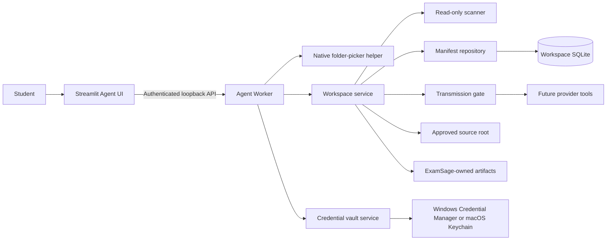

# ExamSage Secure Course Workspace Design

- Status: Approved interactive design; pending written-spec review
- Date: 2026-07-21
- Product: ExamSage 0.5 development line
- Subproject: 2 of 6 — Secure course workspace
- Parent design: `2026-07-17-langgraph-agent-design.md`
- Target platforms: Windows and macOS
- User interface language: English

## 1. Purpose

Subproject 2 gives the Agent a secure, durable way to work with a user-selected course folder. A user chooses one folder through a native operating-system dialog, sees every discovered source and its state, adjusts the included set, and approves an immutable manifest before any source content becomes eligible for provider transmission.

The Worker owns filesystem access, manifests, approval enforcement, credential-vault access, retention, and deletion. Streamlit displays state and sends authenticated commands; it never becomes a second filesystem or credential authority.

This subproject also replaces the Agent alpha's in-memory-only credential limitation with Windows Credential Manager and macOS Keychain integration.

## 2. Scope

### 2.1 Included

- Native read-only folder selection on Windows and macOS.
- Browser-development directory-upload fallback using an app-owned intake snapshot.
- Durable course workspaces and folder grants.
- Complete visible source manifests.
- Supported, excluded, failed, changed, removed, and unclassified states.
- SHA-256-bound source approval and a deterministic transmission gate.
- Read-only source-folder enforcement, canonical containment, and symlink/reparse-point rejection.
- Safe ZIP metadata inspection and archive-member preview.
- Local, deterministic initial grouping for folders that contain multiple courses.
- Windows Credential Manager and macOS Keychain storage behind one vault interface.
- Provider-session restoration from the vault and an explicit Forget API key action.
- Workspace rescan, retention, single-workspace deletion, and delete-all-local-data behavior.
- Worker API, event, and minimal Streamlit views required to operate and verify these capabilities.
- Automated security, restart, API, UI, and vertical-slice acceptance tests.

### 2.2 Deferred

- Semantic or multimodal understanding of file contents.
- Provider-powered course classification.
- Chapter trees, evidence records, citations, exam priorities, web research, practice, and exports.
- The final three-pane visual redesign.
- Audio and video.
- Sandboxed App Store distribution and macOS security-scoped bookmarks.

Subproject 3 consumes the approved manifest and transmission gate to implement cloud source understanding. Subproject 5 moves the functional source controls into the final three-pane experience.

## 3. Resolved product decisions

- Implement the complete secure-workspace subproject rather than a folder-only slice.
- Use a Worker-owned native folder picker, not manual path entry.
- Keep a browser directory-upload fallback for development.
- Show the full manifest, allow per-file or subtree exclusion, and provide one-click approval of the remaining included files.
- Require renewed approval for every new or changed hash.
- Save a successfully connected provider credential automatically in the operating-system vault.
- Provide a separate Forget API key action; deleting a workspace does not delete the key.
- Use local path and filename structure for initial course grouping; leave uncertain files unclassified.
- Never send file content for classification before manifest approval.
- Delete only ExamSage-owned data. Never modify, move, or delete the original course folder.
- Retain the Worker-led Python architecture; do not add Tauri, Electron, or a second runtime stack.

## 4. Architecture



### 4.1 Components

The following responsibility boundaries are normative; exact filenames may be adjusted by the implementation plan without changing the boundaries.

- `workspace.models`: typed workspace, folder-grant, scan, manifest, entry, approval, and cleanup contracts.
- `workspace.picker`: native picker helper protocol and injectable picker client.
- `workspace.scanner`: deterministic enumeration, validation, hashing, archive preview, and change detection.
- `workspace.store`: migrations and repositories for workspaces, entries, manifest revisions, approvals, and pending cleanup.
- `workspace.service`: serialized lifecycle operations and authorization checks.
- `workspace.transmission`: the only API that resolves approved files for provider use.
- `security.vault`: provider-neutral vault interface, OS backend, fake backend, and redacted errors.
- `runtime.coordinator`: coordination between provider sessions, active runs, and workspace lifecycle conflicts.
- `worker.api`: authenticated workspace and saved-provider routes.
- `ui.agent_view`: functional workspace selector, coverage summary, manifest table, and approval actions.

No model or arbitrary tool receives an unrestricted filesystem handle, absolute root, vault object, or API key.

## 5. Local data layout

```text
~/.examsage/
  workspace.sqlite3
  agent-runtime.sqlite3
  agent-checkpoints.sqlite3
  workspaces/
    <workspace-id>/
      browser-intake/       # present only for browser fallback
      artifacts/            # future generated/normalized content
      cleanup.json          # optional recovery marker
```

Native-folder sources remain in the original folder and are never copied by Subproject 2. The database stores the canonical root because the user explicitly grants it for reopening and rescanning. Ordinary activity events and UI diagnostics use the workspace display name and relative paths, not the absolute root.

Browser fallback files are copied into an ExamSage-owned immutable intake snapshot because a browser grant cannot be assumed to survive restart. The snapshot is governed by the same manifest and approval rules.

The API key exists only in the OS vault and the Worker's in-memory provider session. Vault record identifiers may be stored; secret values may not.

## 6. Domain model

### 6.1 Workspace

In Subproject 2, one secure intake workspace maps to one selected source root or one browser snapshot. It can contain several proposed course groups, but those groups are views over one grant and one approved manifest rather than duplicated filesystem authorities. Subproject 3 may promote validated groups into separate Agent course workspaces without copying or reapproving unchanged sources.

The secure intake workspace records:

- stable workspace ID;
- user-visible display name;
- source mode: `native_folder` or `browser_snapshot`;
- canonical root or app-owned snapshot identifier;
- lifecycle state: `ready`, `scanning`, `approval_required`, `approved`, `needs_attention`, `deleting`, or `cleanup_pending`;
- current draft-manifest revision;
- current approved-manifest revision, if any;
- created, updated, last-scanned, and last-access-verified timestamps.

### 6.2 Folder grant

A folder grant records the canonical local path, a stable local identity when the platform exposes one, and the last access-verification result. It is local authorization metadata, not permission to transmit content. Every source access revalidates containment and readability.

### 6.3 Manifest entry

Each discovered filesystem item has:

- stable entry ID scoped to a workspace;
- relative POSIX-style path;
- item kind and normalized media/format category;
- byte size and modification time;
- SHA-256 for regular supported files;
- source state;
- inclusion decision and reason;
- proposed local course group or `unclassified`;
- validation or failure code and a safe relative-path message;
- archive-parent/member metadata when applicable.

Source state and course assignment are separate fields. A valid approved file can still be unclassified.

### 6.4 Source states

- `pending_approval`: supported and selected, but not approved.
- `approved`: the exact current hash is approved.
- `excluded`: unsupported, out of scope, or intentionally deselected, with a reason.
- `failed`: unreadable or rejected by a security rule.
- `changed`: a previously approved source has a new hash or unstable metadata.
- `removed`: a previously recorded source no longer exists.

Unsupported files remain visible as excluded. Symlinks, junctions, reparse points, and unsafe archive members remain visible as failed and are never followed.

### 6.5 Manifest revision and approval

A scan creates an immutable draft revision. User inclusion changes create a new draft revision rather than mutating a previously approved revision. Approval contains:

- workspace and draft revision IDs;
- the exact set of approved entry IDs and SHA-256 values;
- approval timestamp;
- local policy version.

Approval commits atomically and fails if the draft revision is stale or any selected file no longer matches the draft metadata and hash.

## 7. Native folder selection

The authenticated Worker route starts a short-lived picker helper process. The helper runs its GUI loop on its main thread and opens the operating system's folder selection dialog. The Worker receives one selected path over a private captured pipe; the path is not printed to logs or passed through a command-line argument.

The helper uses the packaged Python GUI capability on Windows and macOS. Picker behavior is injected in tests. Cancel returns a typed cancellation result and creates no workspace.

The Worker canonicalizes and validates the selected directory before storing a grant. Manual path entry is not exposed in the product UI.

## 8. Scanning and hashing

### 8.1 Enumeration

The scanner traverses without following symbolic links or platform reparse points. It records regular files plus rejected link-like items and unsafe archive members. Directories are structural metadata and are not counted as source files unless rejected as an unsafe traversal boundary.

The scanner emits bounded progress by discovered-item count and bytes hashed. One unreadable item does not abort unrelated items.

### 8.2 Format policy

The supported first-release categories remain those in the parent design:

- PDF, DOC/DOCX, PPT/PPTX;
- XLS/XLSX, CSV, TSV, JSON, YAML;
- MD, TXT, HTML;
- PNG, JPEG, WebP, GIF, BMP, TIFF;
- ZIP bundles subject to archive protections.

Audio, video, executables, device files, sockets, and unknown formats are excluded visibly. Subproject 2 does not convert or semantically parse supported files.

### 8.3 Hash safety

Regular supported files are hashed with SHA-256 in bounded chunks. The scanner reads file identity, size, and modification metadata before and after hashing. A file that changes during hashing becomes failed or changed and cannot be approved in that revision.

Hash reuse is permitted after interrupted scans only when the persisted identity, size, and modification metadata still match. Final approval and every transmission perform the stronger current-file validation described below.

### 8.4 Limits

The aggregate selected course workspace limit is 1 GB. File-count, nesting-depth, archive-member-count, expanded-size, compression-ratio, and per-path-length limits are deterministic configuration values with safe defaults and tests. Limit failures affect the specific entry or archive and stay visible in the manifest.

### 8.5 ZIP preview

ZIP inspection reads member metadata without semantic extraction. It rejects traversal, absolute member paths, symlink-like members, encrypted unsupported entries, excessive nesting, excessive member counts, expanded-size limits, and suspicious compression ratios. Safe members appear under their archive parent for coverage; provider preparation and extraction remain Subproject 3 work.

## 9. Approval and transmission gate

No source content is provider-eligible until a manifest revision is approved. Provider tools must obtain source parts through the transmission gate; direct filesystem paths are not valid tool inputs.

For every requested entry, the gate:

1. loads the current approved revision;
2. verifies the entry is approved and the policy version is current;
3. resolves and canonicalizes the current path;
4. verifies containment within the granted root;
5. rejects symlinks, reparse points, special files, and path substitutions;
6. verifies current identity, size, and SHA-256 against approval;
7. returns a short-lived read descriptor to the bounded provider-preparation code.

Any mismatch blocks all transmission of that entry, marks the draft state changed or needs attention, emits a safe user-action event, and pauses a dependent Agent run before a provider request begins.

The LangGraph model sees entry IDs and structured metadata. It never receives arbitrary absolute paths or the ability to bypass approval.

## 10. Multi-course folders

Before approval, local deterministic grouping uses top-level folder structure and sanitized filename tokens only. It never reads semantic contents for grouping.

Confident structural groups become proposed course views inside the secure intake workspace. They are not separate grants, manifest copies, or independent Agent workspaces in this subproject. Ambiguous files remain `unclassified`; the Agent does not silently assign them. Reassignment changes only ExamSage metadata, never the source folder.

Provider-powered refinement occurs in Subproject 3 after approval and remains visibly distinguishable from the local proposal. Subproject 3 is also responsible for promoting refined groups into separate durable Agent course workspaces while retaining the shared approved source authority.

## 11. Credential vault

### 11.1 Interface

The vault interface supports save, load, exists, and delete by provider profile ID. Implementations return stable secret-free errors and never expose the stored value in representations or logs.

The recommended Python integration is the `keyring` package with the native Windows Credential Manager or macOS Keychain backend. The service name is stable and the vault account identifier derives from the local provider profile ID.

### 11.2 Connection lifecycle

On provider connection:

1. the authenticated loopback request sends the key once to the Worker;
2. the Worker constructs and validates the provider session using existing provider boundaries;
3. after connection succeeds, the Worker stores the key in the OS vault;
4. the SQLite profile stores capability and model metadata only;
5. the Worker retains the active SDK client in memory.

On startup, the Worker may restore configured provider sessions from vault entries. A missing or revoked key produces a visible reconnect action and never starts work implicitly.

If the secure backend is unavailable, the current in-memory session remains usable and the UI warns that reconnection will be required after restart. ExamSage never falls back to plaintext, environment-file, SQLite, log, or checkpoint storage.

Forget API key disconnects the profile, deletes the vault entry, and leaves course workspaces intact. Replacement of a profile used by a running or stopping run retains the existing 409 protection.

## 12. Worker API

All routes require the existing per-launch loopback token. Authentication runs before body parsing. Validation and conflict errors contain stable messages and do not expose keys or absolute roots.

```text
POST   /v1/workspaces/select-folder
GET    /v1/workspaces
GET    /v1/workspaces/{workspace_id}
GET    /v1/workspaces/{workspace_id}/manifest
POST   /v1/workspaces/{workspace_id}/rescan
POST   /v1/workspaces/{workspace_id}/approval
PATCH  /v1/workspaces/{workspace_id}/entries/{entry_id}
DELETE /v1/workspaces/{workspace_id}
DELETE /v1/workspaces

GET    /v1/providers/saved
DELETE /v1/providers/{profile_id}/credential
```

Long scans run through a serialized workspace job boundary and publish progress through the existing durable event mechanism. Repeated identical rescan commands are idempotent. An active scan or approval for the same workspace returns the existing job or a stable conflict rather than creating duplicate work.

## 13. User interface

The Agent alpha gains functional workspace controls without prematurely implementing the final three-pane redesign.

The workspace panel provides:

- Choose course folder;
- workspace selector and state;
- Rescan;
- source totals by state;
- filters by state and proposed course;
- a table with relative path, type, size, modified time, state, shortened hash, grouping, and reason;
- per-file and subtree Include/Exclude actions;
- Approve included files;
- Delete workspace;
- Forget API key.

The chat remains the primary interaction surface. Progress messages are concise and show discovered count, bytes hashed, failures, approval requirements, and actionable errors. The final right-side source inspector is Subproject 5 work.

## 14. Lifecycle, concurrency, and recovery

- Canceling the picker creates nothing.
- One unreadable file becomes failed while independent files continue.
- A moved, deleted, or inaccessible root puts the workspace into needs attention.
- Scan drafts are durable. Restart can reuse verified unchanged hashes and reconstruct the current draft.
- One workspace has at most one active scan or approval mutation.
- Repeated commands use idempotency keys and do not create duplicate manifest revisions.
- Approval fails on a stale draft or changed selected entry.
- Transmission failure caused by a hash or path change occurs before any provider call.
- Active or stopping Agent work blocks destructive workspace deletion.
- Deletion requires settled work and is idempotent.
- Partial deletion of ExamSage-owned data records cleanup pending and retries on startup.
- Original source files are never cleanup targets.

Workspace operations use short SQLite transactions and explicit connection closure. Database-visible lifecycle state and its corresponding durable event must become visible atomically where they describe one transition.

## 15. Deletion and retention

Delete workspace removes:

- workspace and manifest rows;
- workspace-linked Agent checkpoints and run metadata as defined by the implementation migration;
- app-owned browser intake snapshots;
- normalized/cache/artifact directories owned by ExamSage;
- pending cleanup markers after success.

It does not remove or alter the native source root and does not delete any provider credential. Forget API key is a separate explicit action.

Delete all local data applies the same source-folder exclusion to every workspace and requires an explicit second confirmation in the UI. Telemetry remains disabled.

## 16. Error model

Errors are typed as:

- user cancellation;
- validation or policy rejection;
- access revoked or source missing;
- stale manifest conflict;
- active-operation conflict;
- transient local I/O failure;
- vault unavailable or credential missing;
- local state corruption.

User-facing messages identify a relative item and next action. Absolute paths, credentials, provider authorization data, raw exception strings, and signed values are centrally redacted from HTTP, events, logs, and exception chains.

The UI must never remain on an unbounded spinner. Every background operation has visible progress, a bounded cancellation boundary, a settled result, or a recoverable paused state.

## 17. Testing strategy

### 17.1 Scanner and security tests

- nested and empty directories;
- Unicode names, long paths, and permission failures;
- stable hashing and change-during-hash detection;
- symlinks, junctions, reparse points, special files, and containment escape;
- supported and unsupported formats;
- ZIP traversal, absolute paths, symlinks, encrypted entries, bombs, counts, depth, and ratios;
- 1 GB aggregate policy without allocating a real 1 GB fixture.

### 17.2 Store, manifest, and approval tests

- immutable draft and approved revisions;
- atomic approval and rollback;
- stale revision conflict;
- include/exclude and subtree changes;
- added, changed, removed, and unchanged rescan results;
- idempotent rescan and approval requests;
- crash and restart recovery;
- explicit connection closure and cleanup retry.

### 17.3 Vault tests

- save, load, restore, replace, and forget against a fake backend;
- backend unavailable without plaintext fallback;
- running-profile replacement conflict;
- secret absence from SQLite, checkpoints, events, HTTP, logs, exception cause/context, diagnostics, and Git diff;
- mocked Windows and macOS backend contract tests.

### 17.4 Worker and UI tests

- auth before body parsing on every new route;
- safe 404, 409, and 422 messages;
- picker cancel and injected picker success;
- progress and manifest pagination/filtering;
- visible state counts matching stored entries;
- approval controls disabled for stale or scanning drafts;
- destructive-action confirmation;
- legacy route remains functional and Agent feature flag behavior remains explicit.

### 17.5 Vertical-slice acceptance

With an injected picker, fake vault, fake provider boundary, and a real temporary filesystem:

1. select a mixed test folder;
2. observe every source as supported, excluded, failed, or unclassified;
3. exclude one supported source;
4. approve the remaining set;
5. prove only approved hashes pass the transmission gate;
6. modify an approved source and prove transmission is blocked before provider invocation;
7. restart and restore the workspace, approval state, and fake credential session;
8. delete the workspace and prove every original source byte remains unchanged.

No external provider, network, or real credential is used by automated acceptance.

## 18. Acceptance gate

Subproject 2 is complete only when fresh evidence demonstrates:

- every discovered item has a visible, reasoned state;
- zero source content is provider-eligible before approval;
- only the exact approved hashes pass the transmission gate;
- new or changed sources require renewed approval;
- the original course folder is byte-for-byte untouched by scan, approval, rescan, and deletion;
- the API key exists in none of the application's databases, checkpoints, events, HTTP responses, logs, exceptions, artifacts, or Git changes;
- a stored fake credential restores the provider session through the vault abstraction;
- vault unavailability has no plaintext fallback;
- cancellation, access loss, restart, stale approval, and partial cleanup have actionable settled states;
- all existing Agent-kernel and legacy tests pass;
- full pytest, Ruff, compileall, and whitespace verification pass;
- an independent final review has no Critical or Important finding.

Manual checkpoints are recorded separately:

- Windows native picker and Credential Manager on an authorized local test profile;
- macOS Finder picker and Keychain on an actual Mac;
- browser directory fallback in a supported development browser.

Unavailable platforms are reported as outstanding rather than falsely marked passed.

## 19. Security invariants

1. Selecting a folder grants local read access, not transmission consent.
2. Approval applies to exact hashes in one immutable manifest revision.
3. Model output and source content cannot expand filesystem authority.
4. The source root is always read-only and never a deletion target.
5. Relative manifest paths cannot escape their canonical grant root.
6. Symlinks, reparse points, and unsafe archive members are never followed.
7. Secrets never enter serializable Agent or workspace state.
8. Only the Worker accesses the vault and source filesystem.
9. Workspace UI and APIs reveal safe relative paths by default.
10. Source change or authorization uncertainty fails closed before a provider call.

## 20. Migration and compatibility

The Agent feature flag remains explicit during Subproject 2. The fixed legacy build route and its tests stay intact. Existing Agent-runtime/checkpoint databases receive additive, versioned workspace migrations; no destructive migration is permitted without a backup-and-rollback design.

Current in-memory provider connection remains available when the vault is missing or unavailable. Adding vault persistence must not weaken the existing provider-session replacement lock, shutdown behavior, pause/resume recovery, or secret-safe exception handling.

The implementation plan must split this design into independently reviewed tasks and use TDD. It must not include Subproject 3 semantic analysis or Subproject 5 layout redesign as convenience scope.
