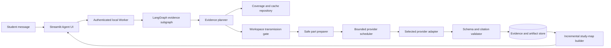

# ExamSage Multimodal Evidence Engine Design

- Status: Approved by delegated product decision
- Date: 2026-07-27
- Product: ExamSage 0.6 development line
- Subproject: 3 of 6 — Multimodal evidence engine
- Parent design: `2026-07-17-langgraph-agent-design.md`
- Dependency: completed secure course workspace at `90e1188`
- Target platforms: Windows and macOS
- User interface languages: English and Simplified Chinese, switchable at runtime

## 1. Purpose

Subproject 3 connects the approved secure course workspace to real provider-powered source tools. It
replaces the legacy all-or-nothing normalization call with a resumable evidence pipeline that processes
every approved source, publishes an honestly partial initial study map quickly, caches completed work by
content hash, and continues toward complete coverage without repeating successful provider calls.

The user-selected performance mode is progressive-first:

- acknowledge the task and show concrete activity within 15 seconds;
- under the published reference conditions, publish an initial chapter tree, initial revision priorities,
  citations, and exact coverage within three minutes;
- label every initial result with processed, pending, failed, and excluded coverage;
- continue processing every approved file in the background while the application remains open;
- checkpoint every validated source part and resume only unfinished work after an explicit Resume;
- never imply that pending or failed content influenced a result.

This subproject does not make the final Agent feature-complete. Adaptive web research, full practice and
rubric tools, the final three-pane product UI, packaging, and legacy removal remain Subprojects 4–6.

## 2. Resolved product decisions

- Use the existing LangGraph Worker as the only Agent execution authority.
- Use the secure workspace transmission gate as the only source-byte boundary.
- Keep one selected provider and one credential; do not add separate OCR, search, or embedding keys.
- Use no local AI or OCR model. Local code may inspect metadata, split files, unpack safe containers,
  extract deterministic text layers, render supported documents, hash bytes, and validate schemas.
- Prioritize syllabus, instructor guidance, past papers, tutorials/problem sets, and revision guides before
  general lecture notes, textbooks, and supplemental references.
- For a single large source, process representative bounded parts across its structure before filling gaps
  sequentially; do not treat the first pages as complete-book coverage.
- Publish partial results by deadline rather than waiting for total coverage.
- Process all approved sources eventually and expose anything not processed.
- Use bounded concurrency rather than unbounded fan-out or fully serial processing.
- Cache immutable evidence by provider profile, model contract, policy version, source hash, and part hash.
- Preserve the original course folder as read-only.
- Keep the legacy fixed pipeline available only as a temporary developer fallback during this subproject.
- Do not claim the three-minute objective without a named reference corpus and measured evidence.

## 3. Scope

### 3.1 Included

- Typed source-part, evidence, coverage, citation, course-group, knowledge-node, and snapshot contracts.
- Durable SQLite repositories for source preparation, evidence units, coverage, study-map snapshots, and
  content-hash cache references.
- Safe provider-part preparation for PDF, DOCX, PPTX, XLSX, text, structured data, images, and ZIP members.
- A converter interface for legacy DOC, PPT, and XLS, with visible failure when a safe converter is absent.
- Bounded provider concurrency, explicit request deadlines, bounded retry, `Retry-After` support, and
  per-part progress.
- OpenAI and Gemini multimodal evidence adapters behind one provider-neutral contract.
- Per-part structured-output validation and one bounded repair attempt.
- Course recognition and semantic refinement of local filename-based course groups.
- Initial and final chapter trees, prerequisites, knowledge points, source coverage, and evidence-backed
  revision priorities.
- LangGraph tools that inspect workspace coverage, build or resume the study map, and answer from stored
  evidence without bypassing source approval.
- Incremental invalidation after an approved file changes or is removed.
- Functional Streamlit progress and evidence coverage views needed to operate the engine before the final
  Subproject 5 redesign.
- Unit, contract, recovery, security, integration, and reference-corpus performance tests.

### 3.2 Deferred

- Evidence-gap web research and comparable-course practice sourcing.
- Full adaptive practice allocation, worked solutions, marking rubrics, answer review, and export assembly.
- The final three-pane interface and installer-quality onboarding.
- Signed Windows/macOS application packages.
- Audio and video.
- Automatic deletion of the legacy fixed pipeline.

## 4. Architecture



The Worker owns planning, source authorization, provider scheduling, checkpoints, events, and writes.
The model receives typed metadata and bounded evidence; it never receives an unrestricted path, file
handle, vault object, API key, database connection, or arbitrary network tool.

## 5. Progressive execution contract

### 5.1 Source priority

The local planner assigns a deterministic priority before content transmission:

1. names and structural groups suggesting syllabus, specification, objectives, instructor guidance, or
   revision guidance;
2. past exams, mark schemes, practice tests, tutorials, assignments, and worked feedback;
3. lecture slides and concise course notes;
4. textbooks and long references;
5. supplemental material and unclassified supported files.

Filename and folder tokens are only scheduling hints. They do not become academic evidence. Semantic
course type and confidence are recorded only after provider analysis.

For one long PDF or document, the initial frontier samples bounded parts from the beginning, middle, and
end plus detected table-of-contents or heading regions when deterministic extraction exposes them. The
remaining parts are scheduled afterward in stable order.

### 5.2 Initial study map

An initial map can be published when all of the following are true:

- at least one high-priority source part has validated evidence, or the workspace has no such source;
- the evidence builder has enough structured headings or concepts to form at least one knowledge node;
- the snapshot includes a complete coverage ledger for every manifest entry;
- every priority and relationship cites only processed evidence units;
- the snapshot is visibly marked `initial` and records its manifest revision.

The reference performance target is three minutes for a healthy reference provider, reference model,
published reference machine, and an approved course pack of at most 100 MB. Slow providers, exhausted
quotas, encrypted/corrupt inputs, and files requiring an unavailable converter produce an honest paused or
degraded state, not a false service-level claim.

### 5.3 Final study map

A snapshot becomes `complete` only when every approved supported source is `processed` or has a terminal,
visible `failed` reason accepted by policy. A complete map can still have limited confidence; completeness
describes source handling, not prediction certainty.

## 6. Domain contracts

### 6.1 Source part plan

Each immutable source-part record contains:

- workspace, manifest revision, entry ID, source hash, and relative path;
- part ID, deterministic ordinal, locator range, media type, and byte estimate;
- preparation policy version and part hash;
- scheduling class and priority reason;
- state: `planned`, `authorized`, `prepared`, `running`, `processed`, `retry_wait`, `failed`, or `invalidated`;
- attempt count, safe error code, timestamps, and idempotency key.

The record contains no API key, authorization header, absolute source path, open handle, or raw SDK object.

### 6.2 Evidence unit

Provider results validate into immutable evidence units containing:

- source and part identity;
- source-relative locator such as page, slide, sheet, section, image, or archive member;
- detected language and material role;
- headings, concepts, definitions, formulas, procedures, examples, and assessment items;
- visual descriptions and OCR text where applicable;
- provider/model contract, extraction timestamp, and structured-output version;
- content limitations, warnings, and prompt-injection indicators;
- citation back to the exact approved source hash and locator.

Evidence prose is untrusted data. It cannot grant tools or modify policy.

### 6.3 Coverage ledger

Coverage is computed from durable source parts, never from UI state. Every manifest entry reports:

- approved bytes and planned part count;
- processed, pending, retrying, failed, and invalidated part counts;
- processed locator ranges;
- last successful evidence time;
- whether the entry influenced the current snapshot;
- safe next action.

Workspace totals expose both file coverage and part coverage so one completed small file cannot disguise an
untouched 357-page book.

### 6.4 Study-map snapshot

Each immutable snapshot contains:

- snapshot ID, workspace, manifest revision, evidence version set, and status `initial` or `complete`;
- course groups and confidence, including `unclassified`;
- hierarchical chapter and knowledge nodes;
- prerequisite relationships;
- relative focus band and separate confidence band;
- evidence counts and source citations per node;
- conflicts, missing coverage, and limitations;
- superseded snapshot ID when applicable.

Numeric ordering values remain labelled relative focus scores, never literal exam probabilities.

## 7. Safe source preparation

- PDF: split by bounded page ranges and provider byte limits. Store page locators and hashes for every part.
- PPTX: preserve slide order; deterministically extract slide text and embedded media relationships. Submit
  bounded slide groups, and send embedded visuals with their slide context only when the provider contract
  requires or benefits from separate visual parts.
- DOCX: preserve headings, paragraphs, tables, footnotes where available, and embedded-media relationships.
- XLSX: prepare bounded sheet/range parts with formulas, displayed values, headers, and linked images.
- CSV/TSV/JSON/YAML/MD/TXT/HTML: decode with bounded size and explicit encoding/error policy; HTML remains
  local course data and cannot trigger URL fetching.
- Images: submit one bounded image or provider-safe frame group. Animated GIF preparation uses a bounded set
  of frames and records omitted frames.
- ZIP: consume only safe member previews authorized by the manifest and prepare members through the same
  part contracts; never trust archive paths.
- DOC/PPT/XLS: use the converter interface in a resource-limited subprocess when available. Absence or
  failure remains visible and does not silently reinterpret the binary file.

Prepared bytes live only in ExamSage-owned temporary or cache directories. Publication is atomic. Cleanup
uncertainty fails closed and retains a safe retry marker.

## 8. Provider execution

### 8.1 Provider-neutral interface

The engine uses a typed adapter with operations equivalent to:

```python
analyze_source_part(request: AnalyzeSourcePartRequest) -> EvidencePartResult
repair_evidence_part(request: RepairEvidencePartRequest) -> EvidencePartResult
build_study_map(request: BuildStudyMapRequest) -> StudyMapResult
```

The adapter accepts bounded bytes or a Worker-owned spool, never an original absolute path. Provider-native
uploads are deleted best-effort after the result or terminal failure.

### 8.2 Concurrency and deadlines

- Default multimodal concurrency is two requests per provider profile.
- Text-only synthesis may use up to four requests when provider capability and quota permit.
- One source part has an explicit provider deadline and one overall tool-job deadline.
- Retryable 429, 5xx, timeout, and transport disconnects use bounded exponential backoff with jitter and
  honor a shorter valid `Retry-After` within the job deadline.
- A part receives at most three provider attempts per model route. Model fallback is one explicit route,
  not a second hidden unbounded retry budget.
- Non-retryable credential, policy, unsupported-model, and invalid-request errors pause immediately.
- Structured-output repair is attempted once with compact validation feedback.

Concurrency limits are configuration owned by deterministic policy. The model cannot raise them.

## 9. Cache and invalidation

The evidence cache key includes:

```text
provider profile capability fingerprint
model ID
evidence schema version
preparation policy version
source SHA-256
part SHA-256 and locator
analysis prompt version
```

Cache entries contain validated evidence only. A rescan with unchanged approved hashes reuses them. A changed
source invalidates only its parts, dependent evidence, affected knowledge nodes, and downstream snapshots.
Unrelated completed files are not retransmitted or regenerated.

Cache references are workspace-scoped for deletion and may share immutable blobs only through reference
counts that never reveal another workspace's filenames or existence.

## 10. LangGraph integration

Subproject 3 adds these bounded Agent tools:

- `inspect_course_sources`: return workspace, approval, course-group, and coverage metadata without source
  content transmission;
- `build_study_map`: plan, authorize, prepare, analyze, validate, checkpoint, and publish initial/final maps;
- `continue_source_analysis`: resume pending/retryable parts after current approval and provider checks;
- `answer_from_course_evidence`: answer a focused question only from already validated evidence and cite it.

The planner can select only registered tools with typed arguments. `build_study_map` is a resumable subgraph,
not a call to `ExamSageAgent.build_course()`. Stop is checked before authorization, before each provider call,
after each validated result, and before snapshot publication.

A run tied to a workspace uses `workspace:<workspace_id>` as its thread. A manifest change pauses dependent
work, invalidates stale authorities, and requires the new revision to be approved before resumption.

## 11. Persistence and events

Additive migrations create logical repositories for:

- source-part plans and attempts;
- evidence units and source citations;
- coverage projections;
- course-group classifications;
- study-map snapshots and dependencies;
- provider-operation receipts containing usage metadata but no secret or raw authorization material.

Each durable transition emits a safe ordered activity event in the same transaction where practical. Events
include counts, relative paths, locators, stages, and next actions but exclude source text, absolute paths,
credentials, signed URLs, and raw exception messages.

## 12. UI behavior for this subproject

Before the final three-pane redesign, the functional Agent page adds:

- shared English/Simplified-Chinese copy keys for every evidence-engine control and state introduced here,
  with the interface preference persisted locally;
- a `Build study map` chat action driven through the normal message box;
- per-workspace file and part coverage;
- current source/locator, processed count, pending count, retry count, and failures;
- an initial-map card with an explicit coverage percentage and `Analysis continues` state;
- Stop and explicit Resume;
- visible credential, approval, source-change, converter, and provider-capacity actions;
- no estimate page, dollar ceiling, or `Build my ExamSage agent` button in Agent mode.

The UI never claims a file was read merely because it was discovered or approved.
Generated study-map prose follows the current user-message language unless that message explicitly requests
another output language; switching interface language does not rewrite or silently regenerate artifacts.

## 13. Error and recovery model

- A failed part does not discard validated sibling parts.
- A process crash recovers `running` parts as `paused` without incrementing attempts until Resume.
- Resume rechecks provider capability, manifest approval, source hash, cache key, and tool deadline.
- Retry continues the failed or pending idempotent part only.
- Provider high demand produces bounded retry events and then a visible paused state.
- Malformed output gets one repair attempt; persistent failure is part-local and visible.
- Unsupported or unavailable conversion is a user-action failure for that file, not a reason to omit it.
- A changed source invalidates dependent snapshots before any stale answer is presented as current.
- No operation leaves an indefinite spinner; every active job has observable progress and a bounded next
  transition.

## 14. Security and privacy invariants

1. Only exact hashes from the current approved manifest can become provider input.
2. Provider tools consume short-lived, single-use transmission grants and Worker-owned bounded spools.
3. The model cannot name arbitrary paths, entry IDs outside the workspace, URLs, or credentials.
4. Original native-folder sources remain read-only and are never cleanup targets.
5. Prepared parts and cache artifacts stay beneath verified ExamSage-owned roots.
6. API keys remain only in the OS vault and in-memory provider session.
7. Checkpoints, evidence, events, usage receipts, logs, HTTP errors, and exports contain no credentials.
8. Source and provider text are untrusted evidence, never executable instructions.
9. Workspace deletion removes its evidence, snapshots, checkpoints, and unshared cache references without
   touching the original folder or provider credential.
10. Approval or identity uncertainty blocks transmission before a provider call.

## 15. Testing strategy

### 15.1 Deterministic unit tests

- source priority, representative large-document sampling, stable part IDs, and cache keys;
- format preparation boundaries and locators;
- evidence schema validation, repair, coverage, and snapshot completeness;
- invalidation by changed hash and unaffected-cache reuse;
- concurrency, deadline, retry, `Retry-After`, Stop, and Resume using injected clocks and fakes.

### 15.2 Provider contract tests

- OpenAI and Gemini request construction with fake SDK transports;
- inline versus uploaded-file routing and best-effort deletion;
- multimodal pages, slides, sheets, scans, handwriting, formulas, tables, and diagrams;
- 429, 503, timeout, protocol disconnect, malformed JSON, truncation, and capability mismatch;
- exact proof that no second credential is requested.

### 15.3 Security and recovery tests

- approval revocation and file substitution at every transmission boundary;
- prompt injection inside text, OCR, images, tables, and metadata;
- path, symlink, reparse, archive, temporary-file, and cache-root attacks;
- crash after provider completion but before publication, proving idempotent recovery;
- secret absence from every new durable and user-visible surface.

### 15.4 Vertical acceptance

With a real temporary mixed-format corpus, fake bounded provider, real Worker, real SQLite stores, and the
actual transmission gate:

1. approve a workspace containing syllabus, past paper, slides, a long PDF, spreadsheet, scan, and ZIP;
2. request a study map in chat;
3. observe activity within the injected 15-second envelope;
4. publish an initial map by the injected three-minute deadline with exact partial coverage;
5. stop, close, restart, and explicitly resume;
6. complete every supported approved source without repeating successful provider calls;
7. modify one file, reapprove, and recompute only dependent evidence and nodes;
8. prove citations, focus/confidence separation, and no secret/source leakage.

### 15.5 Live reference benchmark

Maintain a licensed or synthetic at-most-100-MB reference pack and a repeatable command that records machine,
provider, model, request counts, first-activity time, first-map time, final time, coverage, retries, and cost.
Automated fake-time tests do not count as proof of the live three-minute objective. An unavailable provider or
platform remains honestly outstanding.

## 16. Acceptance gate

Subproject 3 is complete only when fresh evidence demonstrates:

- the Agent route consumes approved workspace sources through the transmission gate;
- the legacy `build_course()` path is not invoked by Agent study-map work;
- every approved file has durable planned/processed/pending/failed coverage;
- a qualifying reference run publishes an initial cited map within three minutes;
- work continues to complete coverage and never hides pending or failed sources;
- Stop/restart/Resume repeats no completed provider operation;
- unchanged hashes reuse evidence and changed hashes invalidate exact dependencies;
- OpenAI and Gemini contract suites cover multimodal, retry, timeout, and malformed-output behavior;
- keys and source bytes do not leak into prohibited storage or diagnostics;
- full pytest, Ruff, compileall, dependency, secret, and Git whitespace gates pass;
- manual Windows folder/vault checks and available live provider checks are recorded honestly;
- an independent whole-subproject review has no Critical or Important finding.

## 17. Migration and compatibility

- Migrations are additive and preserve the existing runtime and secure workspace databases.
- Existing approved workspaces remain valid and acquire evidence state lazily.
- Existing legacy saved reports remain readable.
- Agent mode remains feature-flagged until this acceptance gate passes and the first Subproject 4 vertical
  slice is available; afterward Agent mode becomes the default and legacy requires an explicit developer flag.
- No legacy intake data is silently imported as approved Agent evidence.
- Cleanup of abandoned legacy intake copies requires a separate visible user action and must never delete
  original materials.

## 18. Follow-on boundaries

Subproject 4 consumes validated evidence and study-map snapshots to implement request-specific web research,
adaptive practice, worked solutions, marking rubrics, tutor verification, and exports. Subproject 5 turns the
functional controls into the final three-pane experience. Subproject 6 adds clean installers, live performance
and academic evaluation gates, repository cleanup, demos, release hardening, Agent-by-default behavior, and
deletion of the fixed pipeline after parity.
